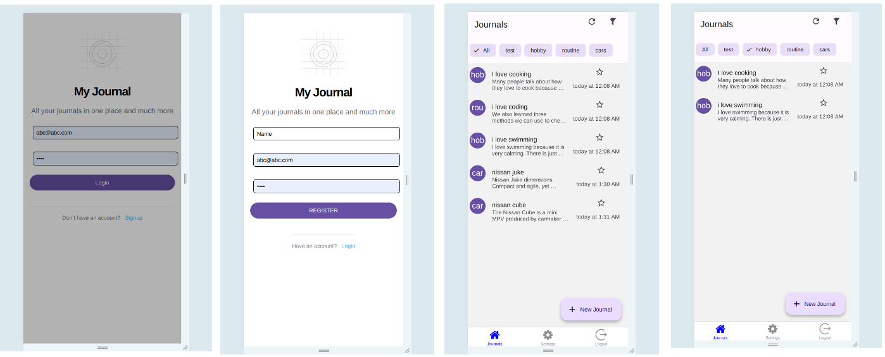
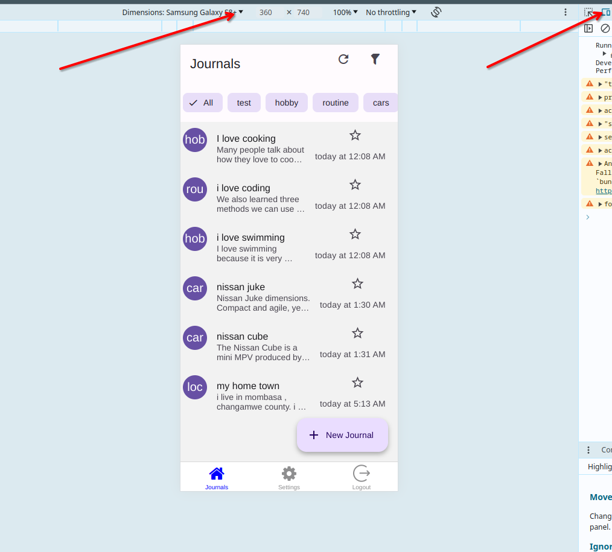
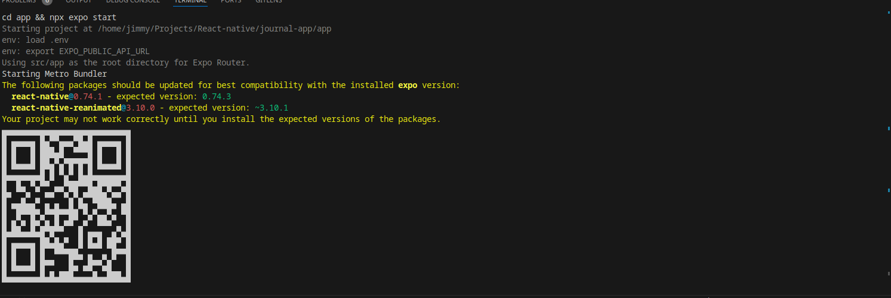

# journal-app

A mobile application and a backend service for personal journaling.

## Components

**app**

The app is built uising react native framework.

**backend**

The backend is built in python using fastapi framework.

## Usage

1. On terminal and run `make prod_api` to start the api.
   - (OPTIONAL). Test/View the api via its swagger-ui at [http://localhost:5000/docs](http://localhost:5000/docs)

2. Open a separate terminal  and run `make app` .This will install app dependecies and run the app in development mode.
    - To test the app via webbrowser-mode: Open  [http://localhost:8081]( http://localhost:8081) in a webbrowser , preferably google-chrome. Open developer tools click [`CTRL+SHIFT+1`] , click toogle responsive devices and select a device , ie samsaung galaxy-s8 see screenshot below.
    

    - To test with a device: Install [Expo Go]() in your device , and scan the QR code shown in the app run terminal console. see screenshot below.
    

## Video tutorial

